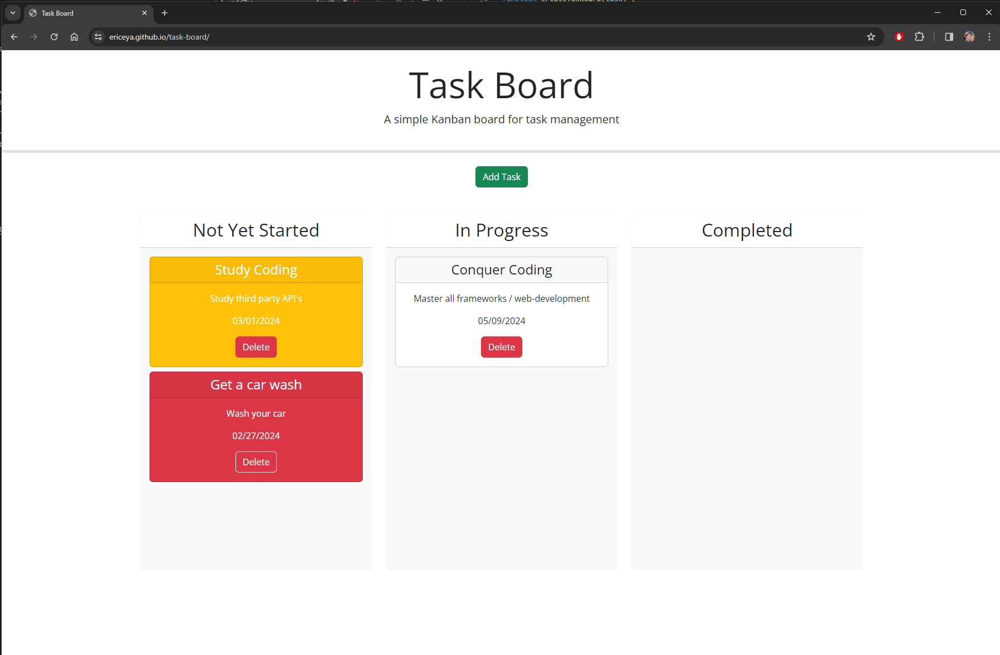

# To-do task board

Whole layout of the taskboard is simple and has been incorporated by using bootstrap styling.
Modal was also used from bootstrap for gathering task data entry page.

## Features on this project

* Jquery UI for `.datepicker()` was used to incorporate better UI on calendar dropdown when selecting dates
* Jquery for adding event listener with event-delegation
* Active localStorage update with functions
* Deleting a card using `.splice()` from array
* Working with arrays of objects / different functions
* `crypto.randomUUID()` for generating a long unique alphanumeric identifier.
* Create elements and appending them to correct places in html

## Screenshot of the working app

## Link to deploy

[Click here for deployed link](https://ericeya.github.io/task-board)